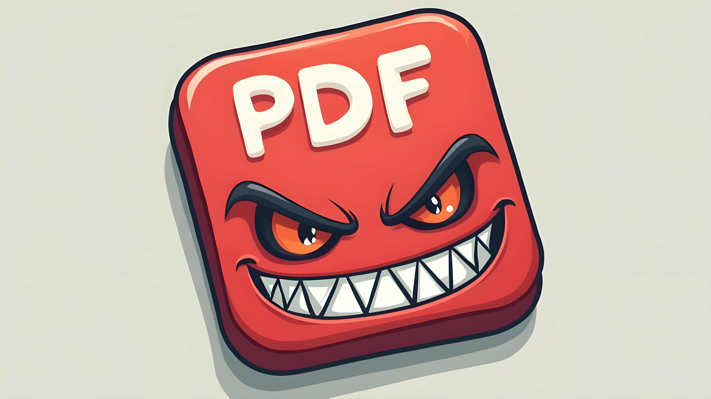

<div align="center">
  <h1>📄 PDmFer</h1>
  <p><b>THE PDF EMBEDDING POWERHOUSE</b></p>
  
  
</div>

<div align="center">
  
  
  &nbsp;
  
  &nbsp;
  
  &nbsp;
  
  
</div>

<p align="center">
  <a href="#overview">Overview</a> •
  <a href="#features">Features</a> •
  <a href="#installation">Installation</a> •
  <a href="#usage">Usage</a> •
  <a href="#examples">Examples</a> •
  <a href="#security">Security</a> •
  <a href="#contributing">Contributing</a>
</p>

<hr>

<br>

## 🎯 OVERVIEW

**PDmFer** is a command-line tool designed to embed interactive elements into PDF documents with enterprise-grade reliability.

Transform ordinary PDFs into `interactive`, `secure`, and `customized` documents with download redirects, blur effects, password protection, and custom metadata.

### 📄 THE PIPELINE

---

**PDmFer**:

1. **TAKES** your input PDF document
2. **EMBEDS** interactive elements (download redirects, JavaScript, metadata)
3. **APPLIES** visual effects (blur) and security (password protection)
4. **OUTPUTS** enhanced, production-ready PDF

Built with robust error handling and optimized for high-performance processing of large PDFs across Windows, macOS, and Linux platforms.

<br>

## 🚀 INSTALLATION

### PREREQUISITES

- Python 3.8 or higher
- pip package manager
- Virtual environment (recommended)

### 🔨 SETUP STEPS

**1. CLONE THE REPOSITORY**

```bash
git clone <repository-url>
cd pdmfer
```

**2. CREATE VIRTUAL ENVIRONMENT**

```bash
python3 -m venv venv
source venv/bin/activate  # On Windows: venv\Scripts\activate
```

**3. INSTALL DEPENDENCIES**

```bash
pip install -r requirements.txt
pip install -e .
```

### ⚡ QUICK START

Get started in seconds:

```bash
# Basic download redirect
pdmfer -i input.pdf -o output.pdf --link "https://example.com"

# With blur and password
pdmfer -i input.pdf -o output.pdf --link "https://example.com" --blur Medium --password "secure123"
```

<br>

## ⚡ FEATURES

<table>
<tr>
<td width="50%">

### CORE CAPABILITIES

- ✅ **Download redirects** embedded in PDFs
- 🔗 **Custom link integration** for interactive documents
- 🔒 **Password protection** with AES-128 encryption
- 📝 **Custom metadata** (Title, Author, Subject, Keywords)
- 🎨 **Blur effects** (None, Low, Medium, High)
- 💬 **Custom messages** for pre-download redirects
- 📊 **Enterprise-grade** error handling
- 💾 **File-based workflow** for easy integration

</td>
<td width="50%">

### ADVANCED FEATURES

- 🌐 **Cross-platform** support (Windows, macOS, Linux)
- ⚡ **High-performance** optimized processing
- 🔧 **Verbose mode** for detailed logging
- 📦 **Batch processing** support
- 🛡️ **Security controls** with JavaScript embedding
- 🎯 **Link validation** ensuring proper URL formats
- 🔄 **Multi-library** approach for feature compatibility
- 📈 **Efficient memory** usage for large PDFs

</td>
</tr>
</table>

<br>

## 📋 USAGE

### 🎯 BASIC SYNTAX

```bash
pdmfer -i input.pdf -o output.pdf --link "https://example.com" [options...]
```

### 🔧 OPTIONS REFERENCE

<table>
<tr>
<th>Option</th>
<th>Description</th>
<th>Values</th>
<th>Default</th>
</tr>
<tr>
<td><code>-i, --input</code></td>
<td>Input PDF file path</td>
<td>File path</td>
<td><b>Required</b></td>
</tr>
<tr>
<td><code>-o, --output</code></td>
<td>Output PDF file path</td>
<td>File path</td>
<td><b>Required</b></td>
</tr>
<tr>
<td><code>--link</code></td>
<td>Link address for embedded PDF</td>
<td>URL string</td>
<td><b>Required</b></td>
</tr>
<tr>
<td><code>--blur</code></td>
<td>Blur level</td>
<td><code>None</code>, <code>Low</code>, <code>Medium</code>, <code>High</code></td>
<td><code>None</code></td>
</tr>
<tr>
<td><code>--password</code></td>
<td>Password protection</td>
<td>Password string</td>
<td>None</td>
</tr>
<tr>
<td><code>--redirect-message</code></td>
<td>Custom pre-download message</td>
<td>Text string</td>
<td>None</td>
</tr>
<tr>
<td><code>--title</code></td>
<td>Custom PDF title metadata</td>
<td>Text string</td>
<td>None</td>
</tr>
<tr>
<td><code>--author</code></td>
<td>Custom PDF author metadata</td>
<td>Text string</td>
<td>None</td>
</tr>
<tr>
<td><code>--subject</code></td>
<td>Custom PDF subject metadata</td>
<td>Text string</td>
<td>None</td>
</tr>
<tr>
<td><code>--keywords</code></td>
<td>Custom PDF keywords metadata</td>
<td>Comma-separated text</td>
<td>None</td>
</tr>
<tr>
<td><code>-v, --verbose</code></td>
<td>Enable verbose output</td>
<td>Flag</td>
<td>Disabled</td>
</tr>
</table>

<br>

## 💡 EXAMPLES

### BASIC OPERATIONS

<details>
<summary><b>Click to expand basic examples</b></summary>

```bash
# Simple download redirect
pdmfer -i input.pdf -o output.pdf --link "https://example.com"

# With blur effect
pdmfer -i input.pdf -o output.pdf --link "https://example.com" --blur High

# With password protection
pdmfer -i input.pdf -o output.pdf --link "https://example.com" --password "secret123"

# Complete basic example
pdmfer -i input.pdf -o output.pdf \
  --link "https://example.com/download" \
  --blur Medium \
  --password "secure123" \
  --redirect-message "Download will start shortly"
```

</details>

### ADVANCED OPERATIONS

<details>
<summary><b>Click to expand advanced examples</b></summary>

```bash
# Full customization with all options
pdmfer -i input.pdf -o output.pdf \
  --link "https://example.com/download" \
  --blur Medium \
  --password "securepassword123" \
  --redirect-message "Accessing secure content..." \
  --title "Secure Document" \
  --author "John Doe" \
  --subject "Confidential Report" \
  --keywords "secure,confidential,report" \
  --verbose

# Process confidential corporate document
pdmfer -i confidential.pdf -o secure_confidential.pdf \
  --link "https://internal.example.com/access" \
  --blur High \
  --password "enterprise_secret" \
  --redirect-message "Accessing restricted content. Authentication required." \
  --title "Confidential Document" \
  --author "Corporate Security Team" \
  --subject "Internal Use Only" \
  --keywords "confidential,restricted,secure,corporate"

# Batch processing script
find . -name "*.pdf" -exec pdmfer -i {} -o processed_{} \
  --link "https://secure.example.com" \
  --blur Low \;
```

</details>

<br>

## 🔬 CORE CONCEPTS

### 🎨 BLUR EFFECTS EXPLAINED

<table>
<tr>
<td><b>None</b></td>
<td>No blur effect applied - original content preserved</td>
</tr>
<tr>
<td><b>Low</b></td>
<td>Subtle blur for mild privacy or aesthetic effect</td>
</tr>
<tr>
<td><b>Medium</b></td>
<td>Moderate blur for general obfuscation</td>
</tr>
<tr>
<td><b>High</b></td>
<td>Strong blur for maximum privacy or visual effect</td>
</tr>
</table>

Blur effects work by converting PDF content to images and applying Gaussian blur filters.

### 📝 METADATA CUSTOMIZATION

Custom metadata improves document organization and searchability:

- **Title** - Document name in PDF viewers and file systems
- **Author** - Creator attribution
- **Subject** - Brief description of content
- **Keywords** - Comma-separated tags for search and categorization

<br>

## 🛡️ SECURITY CONSIDERATIONS

### 🔒 PASSWORD PROTECTION
- Uses **AES-128 encryption** for PDF security
- Protects against unauthorized access
- Compatible with standard PDF viewers

### 🔐 JAVASCRIPT SECURITY
- All JavaScript is embedded within the PDF
- Execution requires JavaScript-enabled viewer
- Follows PDF security standards

### ✅ LINK VALIDATION
- All links must use full URL format (http:// or https://)
- Links are validated before PDF creation

<br>

## ⚠️ TROUBLESHOOTING

### COMMON ISSUES

<details>
<summary><b>Click to expand troubleshooting guide</b></summary>

**1. "Error: Input file does not exist"**
- Verify the file path is correct
- Ensure the input file has a `.pdf` extension

**2. "Error: Link must start with http:// or https://"**
- Ensure your link uses the proper protocol
- Example: `https://example.com` not `example.com`

**3. JavaScript features not working**
- Check that your PDF viewer has JavaScript enabled
- Some viewers disable JavaScript for security reasons

**4. PDF appears corrupted**
- Ensure all required options are provided
- Check file permissions for input and output directories

</details>

### 💬 VERBOSE MODE

Use the `-v` flag for detailed output:

```bash
pdmfer -i input.pdf -o output.pdf --link "https://example.com" -v
```

<br>

## 📊 PERFORMANCE

PDmFer is designed for high-performance processing:

- ⚡ **Efficient memory usage** for large PDFs
- 🚀 **Optimized processing** algorithms
- 🔧 **Multi-library approach** for feature compatibility
- 📈 **Enterprise-grade** reliability

<br>

## 🤝 CONTRIBUTING

Contributions are welcome! Feel free to:

- 🐛 Report bugs
- 💡 Suggest new features
- 🔧 Submit pull requests
- 📖 Improve documentation

### CONTRIBUTING STEPS

1. Fork the repository
2. Create a feature branch
3. Submit a pull request
4. Ensure all tests pass

<br>

## 📄 LICENSE

**PDmFer** is available in the **public domain**. See [UNLICENSE.md](./UNLICENSE.md) for details.

<br>

<div align="center">
  <hr>
  <p><i>Transform your PDFs with enterprise-grade security and interactivity</i></p>
  <p><b>PDmFer</b> - where PDF meets power</p>
</div>